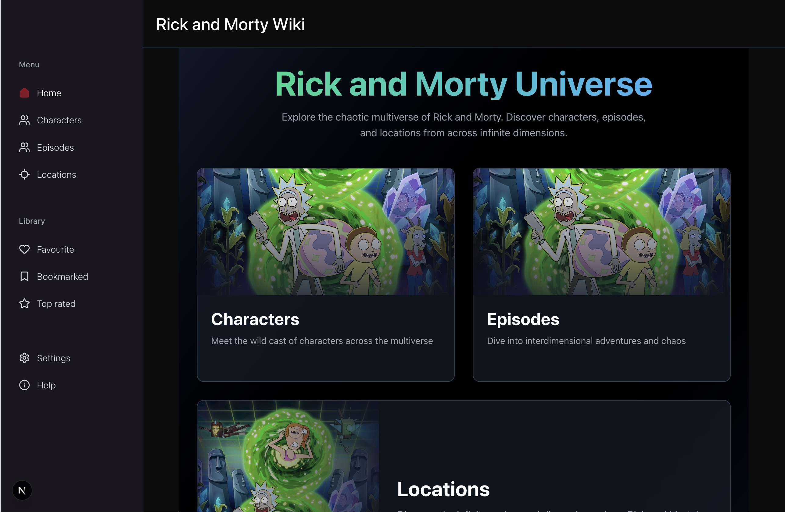

# Rick and Morty

A single-page React (Next.js + TypeScript) application that allows users to explore data from a public API with search, filter, sort, and favorites functionality.

---

## 🚀 Demo

- **Live Preview**: [rickandmorty-neon-eta.vercel.app]
- **GitHub Repository**: [https://github.com/JusticeOpara/rickandmorty](https://github.com/JusticeOpara/rickandmorty)

---

## 📌 Features

### Must-Haves Implemented

- **List + Detail View**:
  - Paginated list view of items from the chosen API.
  - Click an item to open a dedicated detail route (`/items/:id`).
- **Search, Filter, Sort**:
  - Debounced search (300ms) synced to the URL (`?q=query`).
  - Filter by status/species/type (depending on dataset).
  - Sort items by name, status, or other criteria.
  - All state is URL-driven for shareability and reload safety.
- **Favorites**:
  - Toggle favorites from list and detail views.
  - Persist favorites in `localStorage`.
  - "Favorites" filter to quickly view saved items.
- **Data Handling**:
  - Loading skeletons.
  - Error boundaries with retry support.
  - Cancel in-flight requests on input changes to prevent race conditions.

### Nice-to-Haves Implemented

- **Client caching** with React Query for instant back/forward navigation.
- **Optimistic UI** for favoriting actions.
- **Theme toggle** (light/dark) persisted in `localStorage`.
- **Code splitting** for the detail route.

---

## 🛠 Tech Stack

- **Framework**: [Next.js](https://nextjs.org/) + [TypeScript](https://www.typescriptlang.org/)
- **Styling**: [Tailwind CSS](https://tailwindcss.com/)
- **Data Fetching & Caching**: [React Query](https://tanstack.com/query)
- **Routing & URL State Management**: Next.js Router
- **UI Components**: Custom + Tailwind utilities
- **Persistence**: localStorage
- **Deployment**: [Vercel](https://vercel.com/) _(optional)_

---

## 📂 Project Structure

